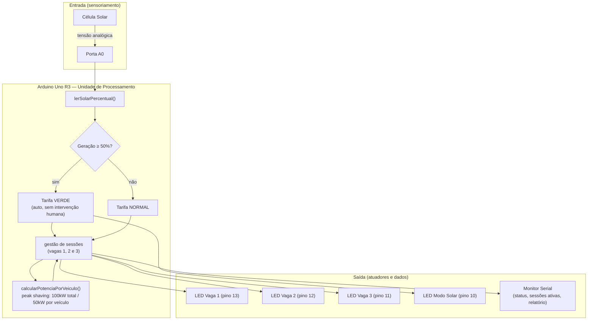
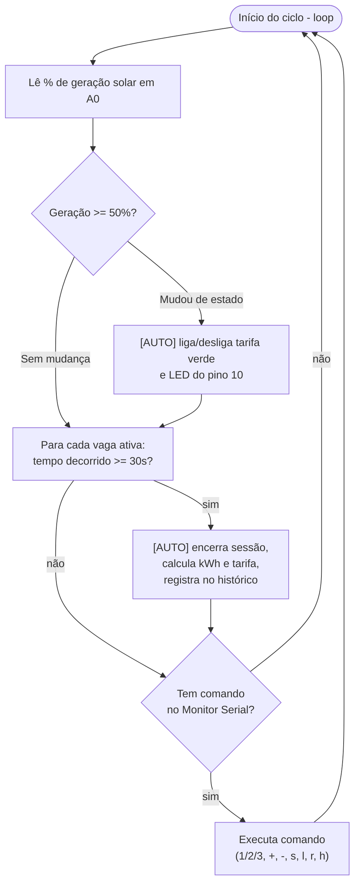
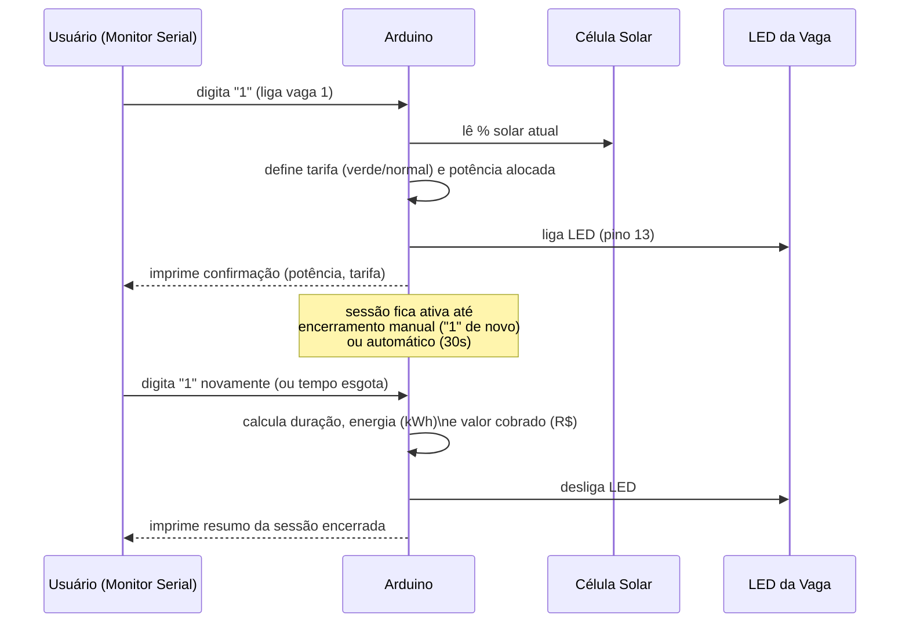

# ⚡ Estação LightWeek

### Sprint 3 — Prototipagem Funcional e Integração

---

## 📋 Equipe e RMs

* **Maykon de Lima Silva** — RM: 574022
* **Felipe Pereira Restivo** — RM: 570712
* **Gabriel Rodrigues Zappelloni** — RM: 572060
* **Rodger Costa Rios** — RM: 571438
* **Kenichi Caio Yamamoto** — RM: 569815

**Turma:** 1CCPK
**Disciplina:** SERS — André Tritiack
**Contexto:** Sprint 3 — Prototipagem Funcional e Integração (continuação do desafio FIAP + GoodWe)

---

## 1. 🚀 Sobre o Projeto

A **Estação LightWeek** é um protótipo simulado de uma estação de recarga inteligente para veículos elétricos (EVs), construída em três etapas:

| Sprint | Entrega | Foco |
|---|---|---|
| 1 | ChargeGrid Intelligence | Concepção do problema, dos 4 pilares de eficiência energética e da viabilidade regulatória (ANEEL) |
| 2 | Estação LightWeek (PoC) | Prova de conceito em hardware/IoT no Tinkercad: LEDs, leitura de placa solar, *peak shaving* e desconto verde |
| **3** | **Este documento** | Evolução da PoC com **sessões de recarga estruturadas**, **comandos automatizados** e **coleta/exibição de dados funcionais** |

O objetivo desta sprint é demonstrar, de forma funcional, como os componentes de hardware (sensor solar, atuadores/LEDs) se integram com a lógica embarcada (algoritmo de tarifação e de distribuição de potência) para produzir dados reais de operação — sem depender de nenhuma interface externa além do próprio Monitor Serial do Arduino.

---

## 2. 🏛️ Arquitetura e Integração dos Componentes



**Como ler o diagrama:** a célula solar é a única entrada física do sistema. Todo o resto — decisão de tarifa, alocação de potência e o que aparece nos LEDs e no Monitor Serial — é consequência automática dessa leitura combinada com as sessões de recarga abertas pelo usuário.

---

## 3. 🔁 Fluxo Automatizado do Sistema (loop principal)



Os blocos marcados **[AUTO]** acontecem sem nenhum comando do usuário — é o que a Sprint 3 pede como "comandos automatizados": o próprio sistema decide quando trocar de tarifa e quando encerrar uma recarga.

---

## 4. 🔌 Ciclo de Vida de uma Sessão de Recarga



---

## 5. 🛠️ Justificativa Técnica das Escolhas

| Escolha | Justificativa |
|---|---|
| **Arduino Uno R3** | Mantido desde a Sprint 2 pela leitura confiável de portas analógicas e pela facilidade de simular lógica de controle sem depender de conectividade externa — suficiente para provar o conceito de automação antes de escalar para um microcontrolador com Wi-Fi (ex. ESP32) em uma implementação real. |
| **Simulação no Tinkercad** | Permite validar a integração hardware + software sem custo de componentes físicos, com reprodutibilidade total para a banca avaliadora (qualquer pessoa pode abrir o link e rodar). |
| **Célula Solar simulada (entrada analógica)** | Representa, de forma simplificada, a variação real de geração fotovoltaica ao longo do dia. A leitura contínua em `A0` é a base de toda a automação: sem ela, não haveria tarifação dinâmica. |
| **LED dedicado ao modo solar (pino 10)** | Evolução em relação à Sprint 2: antes a tarifa verde só aparecia como texto no Serial. Agora existe um atuador físico que reage sozinho ao sensor — evidência tangível de automação, não apenas lógica de software. |
| **Sessões estruturadas por vaga (struct)** | Substitui o contador genérico da Sprint 2. Cada vaga agora carrega seu próprio histórico (início, potência, tarifa), o que é pré-requisito para calcular energia e cobrança por sessão — exatamente o "dado funcional" pedido na Sprint 3. |
| **Peak shaving (100kW total / 50kW por veículo)** | Mantido da Sprint 2 e agora recalculado automaticamente a cada entrada/saída de veículo, sem intervenção manual — protege a rede elétrica simulada contra sobrecarga, um dos 4 pilares definidos na Sprint 1. |
| **Tarifa dinâmica (R$ 2,50 normal / R$ 1,75 verde)** | Simula em números o pilar de "Tarifação Dinâmica" da Sprint 1, mostrando de forma concreta o incentivo econômico ao uso da estação em horários de maior geração solar. |
| **Encerramento automático por tempo (30s simulados)** | Demonstra automação de ponta a ponta: o sistema não depende do usuário lembrar de encerrar a sessão, assim como um carregador real encerraria ao detectar bateria cheia. |
| **Monitor Serial como painel de dados** | Cumpre o papel do "dashboard" do sistema sem exigir uma camada web adicional — os comandos `l` (sessões ativas) e `r` (relatório consolidado) entregam a coleta e exibição de dados pedidas no briefing, mantendo o protótipo 100% dentro do ambiente Arduino/Tinkercad. |

---

## 6. 📊 Resultados e Dados Funcionais

O protótipo produz, por sessão de recarga encerrada, os seguintes dados:

* Vaga, duração (s), energia estimada (kWh), tarifa aplicada (normal/verde) e valor cobrado (R$)
* Quando a tarifa é verde, também a economia gerada em relação à tarifa normal

E, de forma agregada (comando `r`):

* Total de sessões concluídas e quantas delas em tarifa verde
* Energia total entregue (kWh)
* Receita total (R$) e economia total gerada pela tarifa verde (R$)
* Histórico das últimas 10 sessões

> ⚠️ **A preencher pelo grupo:** o bloco abaixo é um exemplo ilustrativo do formato de saída — ele mostra a estrutura que o código gera, mas **não é uma captura real**. Antes de entregar, rodem a simulação no Tinkercad, testem os comandos `1`, `2`, `l`, `s` e `r`, e substituam o bloco pela transcrição real (ou print) do Monitor Serial de vocês.

```
----- STATUS DA ESTACAO -----
Geracao solar atual : 62.3 %
Tarifa em vigor      : VERDE (desconto solar)
Vagas ocupadas       : 2 de 3
Potencia por veiculo : 50.00 kW

<< Sessao encerrada na vaga 1
   Duracao: 18 s
   Energia estimada: 0.2500 kWh
   Valor cobrado: R$ 0.44
   Economia (tarifa verde): R$ 0.19

========= RELATORIO CONSOLIDADO =========
Sessoes concluidas total : 3
  - com tarifa verde     : 2
Energia total entregue   : 0.9800 kWh
Receita total            : R$ 1.87
Economia gerada (verde)  : R$ 0.51
```

---

## 7. 🎓 Conexão com os Conteúdos da Disciplina

* **Sustentabilidade e eficiência energética:** a tarifa dinâmica atrelada à geração solar traduz em código o conceito de gestão de demanda alinhada à disponibilidade de energia limpa, reduzindo a dependência de fontes não renováveis nos horários de pico.
* **Automação inteligente:** os três pontos marcados como `[AUTO]` no fluxograma (Seção 3) mostram decisões tomadas pelo sistema sem intervenção humana — a essência de um sistema de automação, em oposição a um circuito puramente reativo a comandos manuais.
* **IoT (sensoriamento + atuação):** o ciclo sensor (célula solar) → processamento (Arduino) → atuador (LEDs) é o modelo básico de um sistema IoT, aqui aplicado à gestão de infraestrutura de recarga.
* **Integração de sistemas:** a evolução do contador simples da Sprint 2 para sessões estruturadas com histórico é uma aplicação prática de modelagem de dados (structs) para representar entidades do mundo real (uma sessão de recarga) dentro de um sistema embarcado.
* **Viabilidade regulatória (ANEEL):** a lógica de tarifação dinâmica aqui simulada é a materialização, em código, do pilar de "Tarifação Dinâmica" e da Resolução Normativa ANEEL nº 1.000/2021 discutidos na Sprint 1.

---

## 8. 💻 Instruções de Reprodução

### Montagem do circuito (Tinkercad)

| Componente | Pino do Arduino |
|---|---|
| LED Vaga 1 (+ resistor) | Digital 13 |
| LED Vaga 2 (+ resistor) | Digital 12 |
| LED Vaga 3 (+ resistor) | Digital 11 |
| LED Modo Solar (+ resistor) — **novo na Sprint 3** | Digital 10 |
| Célula Solar (saída +) | A0 |
| Célula Solar (GND) | GND |


### Comandos disponíveis

| Comando | Ação |
|---|---|
| `1` / `2` / `3` | Liga ou desliga a sessão de recarga na vaga correspondente |
| `+` | Inicia sessão na primeira vaga livre |
| `-` | Encerra a sessão ativa mais antiga |
| `s` | Mostra o status atual (solar, tarifa, potência) |
| `l` | Lista as sessões ativas no momento |
| `r` | Gera o relatório consolidado (dados funcionais) |
| `h` | Mostra o menu de ajuda |
---

## 9. 🎥 Vídeo Demonstrativo

https://youtu.be/DTuNJHXfYBg

---

## 10. 🔗 Repositório

https://github.com/zappelloni/Estacao-LightWeek-Sprint3
